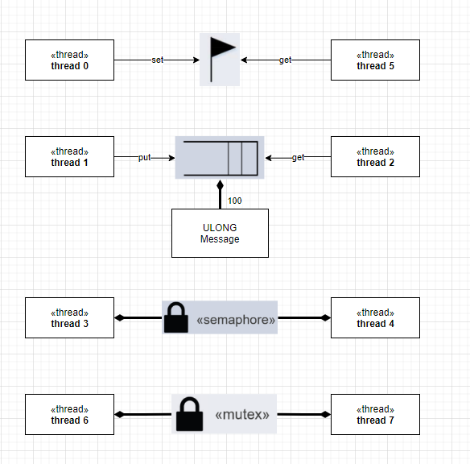

# felbarboza_ELF74

Lab 1 - O "Hello World" aparece no terminal I/O

Lab 2 - Variáveis volatile: São declaradas assim para sinalizar ao compilador que ele não deve otimizar nada relacionado a essa variável, para facilitar o acesso a hardware, mapeamento de memória de I/O e uso de threads.

Lab 5 -

| Thread Name |    entry function    | stack size | priority | auto start | time slicing |
|:-----------:|:--------------------:|:----------:|----------|------------|--------------|
|   thread 0  |    thread_0_entry    |    1024    |     1    |     yes    |      no      |
|   thread 1  |    thread_1_entry    |    1024    |    16    |     yes    |       4      |
|   thread 2  |    thread_2_entry    |    1024    |    16    |     yes    |       4      |
|   thread 3  | thread_3_and_4_entry |    1024    |     8    |     yes    |      no      |
|   thread 4  | thread_3_and_4_entry |    1024    |     8    |     yes    |      no      |
|   thread 5  |    thread_5_entry    |    1024    |     4    |     yes    |      no      |
|   thread 6  | thread_6_and_7_entry |    1024    |     8    |     yes    |      no      |
|   thread 7  | thread_6_and_7_entry |    1024    |     8    |     yes    |      no      |

|      Name     | control structure |             size             |     location     |
|:-------------:|:-----------------:|:----------------------------:|:----------------:|
|  byte pool 0  |    byte_pool_0    |             9120             | byte_pool_memory |
|    queue 0    |      queue_0      |       100*sizeof(ULONG)      |      pointer     |
|  semaphore 0  |    semaphore_0    |     sizeof(TX_SEMAPHORE)     |   &semaphore_0   |
| event flags 0 |   event_flags_0   | sizeof(TX_EVENT_FLAGS_GROUP) |  &event_flags_0  |
|    mutex 0    |      mutex_0      |       sizeof(TX_MUTEX)       |     &mutex_0     |
|  block pool 0 |    block_pool_0   |              100             |      pointer     |

Lab 6 -

Tempo de execução do loop: 1.45uS
Medido a partir de cronometro, rodando 10 milhões de vezes e demorando 14,5 segundos

4- 

A- Escalonamento por time-slice de 50 ms. Todas as tarefas com mesma prioridade.

Pode ser visto que as tarefas respeitam seus períodos e que como o escalonamento por time-slice é de 50ms, os leds piscam rapidamente entre sí várias vezes.

B- Escalonamento sem time-slice e sem preempção. Prioridades estabelecidas no passo 3. A preempção pode ser evitada com o “preemption threshold” do ThreadX.

É visto que as tarefas esperam a que está sendo executada liberar o processador e são executadas conforme prioridade
Então os leds não ficam alternando entre si, sempre esperam o anterior terminar a execução
O período das tarefas é praticamente constante, a não ser que outra já esteja em execução

C- Escalonamento preemptivo por prioridade.

Nesse caso já é notável que o led com mais prioridade interrompe a execução do atual para ser executado e então retorna para do anterior.
Então há alternancia entre os leds.
Ou seja, a thread 1 executa no período de 1 segundo naturalmente
A thread 2 pode ser interrompida pela thread 1, o que pode aumentar seu período de execução
E a thread 3 pode ser interrompida pela 1 e 2, aumentando ainda mais seu período

D- Implemente um Mutex compartilhado entre T1 e T3. No início de cada job estas tarefas devem solicitar este mutex e liberá-lo no
final. Use mutex sem herança de prioridade. Observe o efeito na temporização das tarefas.

Com o Mutex, a thread 1 e 3 não podem dar preempção entre si
Os períodos de execução de cada thread varia, pois dependendo se a thread 1 ou a thread 3 está com o mutex, pode aumentar o tempo.
O mesmo vale para a thread 2, que pode aumentar o tempo caso a thread 1 mude de suspensa para pronta.
E a thread 3 pode aumentar seu periodo caso thread 2 mude para pronta ou caso thread 1 esteja com o mutex

E- Idem acima, mas com herança de prioridade.

Similarmente ao caso acima, porém a thread 2 pode aumentar seu período caso a thread 3 esteja executando, pela herança de prioridade do mutex